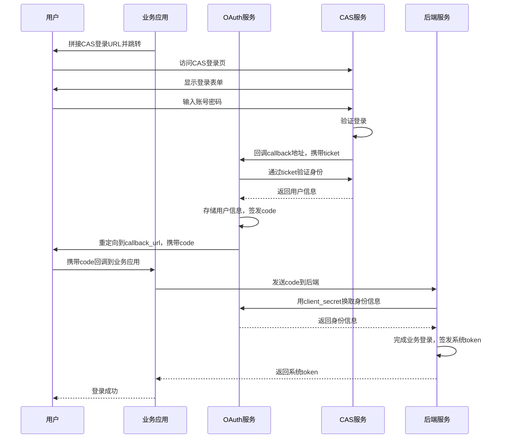

# CAS 适配说明与本地调试

## 1. 功能定位

当前 `muxi_auth_service_v2` 已经同时支持两套获取 OAuth 授权码的方式：

1. 原有用户名/密码模式  
   客户端调用 `POST /auth/api/oauth`，直接拿到授权码。

2. 新增 CAS 模式  
   客户端先跳转到 CAS 登录页，CAS 登录成功后回调本服务的 `GET /auth/api/oauth/cas/callback`，再由本服务签发 OAuth 授权码并重定向回业务系统。

这意味着：

- 下游业务系统依旧只需要理解 OAuth 授权码、`access_token`、`refresh_token`
- CAS ticket 只在本服务内部消费一次
- 客户端不需要自己去调用 CAS 的 `serviceValidate`

## 2. 当前 CAS 适配的实际行为

### 2.1 整体时序图

下面这张时序图描述了当前“业务应用 -> CAS -> OAuth 服务 -> 业务后端”的完整登录链路：



这个图里有三点需要特别注意：
- 开始访问 CAS 系统的 URL 是通过client_id(每个服务在oauth服务这边注册得到的),callback_url(每个服务自己管理的)等参数拼接而成的,
- CAS ticket 只在 OAuth 服务内部使用一次，业务应用和业务后端都不直接消费 CAS ticket。
- 业务系统最终感知到的仍然是 OAuth 授权码和它自己签发的业务 token，而不是 CAS 会话本身。

### 2.2 回调入口

CAS 登录完成后，会回调到：

```text
/auth/api/oauth/cas/callback
```

这个接口要求至少携带以下查询参数：

- `ticket`：CAS 回调带回来的 service ticket
- `client_id`：要给哪个 OAuth 客户端发授权码
- `callback_url`：OAuth 授权码最终要重定向回去的业务地址
- `token_exp`：可选，透传给 OAuth 授权码对应的 token 过期时间配置

### 2.3 处理流程

服务端收到 callback 之后，会按下面的顺序处理：

1. 读取 `ticket`、`client_id`、`callback_url`、`token_exp`
2. 根据当前请求还原出当初传给 CAS 的原始 `service` URL
3. 使用 `cas.server_url` 指定的 CAS 服务执行 ticket 校验
4. 从 CAS 校验结果中拿到用户名
5. 将该用户名编码成独立 subject，格式为 `cas:<username>`
6. 复用现有 OAuth 发码逻辑生成授权码
7. 重定向到 `callback_url?code=...`

### 2.4 与本地用户体系的关系

当前实现里，CAS 用户身份已经与原来的本地 `users.id` 解耦：

- 不再要求将 CAS 用户映射回本地用户表
- 不再依赖原来的本地账号密码体系
- CAS 登录成功后生成的 OAuth subject 为 `cas:<username>`

这意味着 CAS 用户和本地用户是两套独立身份来源。

## 3. 关键配置

当前与 CAS 相关的配置位于 [conf/config.yaml](..\conf\config.yaml)：

```yaml
cas:
  server_url: http://localhost:8443/cas
  callback_base_url: http://localhost:8083
```

含义如下：

- `cas.server_url`
  
  - CAS 服务地址
  - 本服务会基于它调用 CAS 的 ticket 校验接口

- `cas.callback_base_url`
  
  - 当前 OAuth 服务对外暴露的基础地址
  - 用于在 callback 阶段还原原始 `service` URL
  - 当服务跑在反向代理后面时，这个值必须是“外部访问地址”，不能写内部容器地址

## 4. 本地调试前提

本地联调前需要准备三样东西：

1. MySQL
   
   - 当前配置默认连接：
     - 地址：`0.0.0.0:3306`
     - 数据库：`muxisite_auth`

2. CAS 服务
   
   - 仓库内已经提供了本地 CAS 调试目录：
     [cas/docker-compose.yaml](..\cas\docker-compose.yaml)

3. OAuth 服务自身
   
   - 默认监听 `:8083`

## 5. 本地调试步骤

### 5.1 启动 CAS

进入 [cas](..\cas) 目录后执行：

```powershell
docker compose up -d
```

当前已提供的 CAS 服务注册文件是：
[cas/cas-services/service-8083.json](..\cas\cas-services\service-8083.json)

它允许 CAS 回调到：

```text
http://localhost:8083/auth/api/oauth/cas/callback
```

如果你把 OAuth 服务端口或域名改掉了，这个 JSON 也必须一起改。

### 5.2 启动 OAuth 服务

进入项目根目录执行：

```powershell
go run .
```

也可以使用：

```powershell
make
```

默认服务地址是：

```text
http://localhost:8083
```

### 5.3 准备一个 OAuth 客户端

如果你还没有 `client_id` / `client_secret`，可以先调用客户端注册接口：

```bash
curl -X POST "http://localhost:8083/auth/api/oauth/store" \
  -H "Content-Type: application/json" \
  -d "{\"domain\":\"http://localhost:8081\"}"
```

返回示例：

```json
{
  "client_id": "your-client-id",
  "client_secret": "your-client-secret"
}
```

### 5.4 组装 CAS 登录地址

客户端需要自己拼接 CAS 登录地址。关键点是：

- `service` 必须指向本服务的 CAS callback
- `service` 里面还要带上 `client_id` 和 `callback_url`

示例：

```text
http://localhost:8443/cas/login?service=http%3A%2F%2Flocalhost%3A8083%2Fauth%2Fapi%2Foauth%2Fcas%2Fcallback%3Fcallback_url%3Dhttp%3A%2F%2Flocalhost%3A8081%2Flogin%26client_id%3Dyour-client-id
```

如果还要自定义 token 过期时间，也可以继续追加：

```text
token_exp=7200
```

完整示例：

```text
http://localhost:8443/cas/login?service=http%3A%2F%2Flocalhost%3A8083%2Fauth%2Fapi%2Foauth%2Fcas%2Fcallback%3Fcallback_url%3Dhttp%3A%2F%2Flocalhost%3A8081%2Flogin%26client_id%3Dyour-client-id%26token_exp%3D7200
```

### 5.5 浏览器联调观察点

建议按下面的顺序观察：

1. 打开上面的 CAS 登录地址
2. 在 CAS 页面完成登录
3. 浏览器应先回到：
   - `http://localhost:8083/auth/api/oauth/cas/callback?...`
4. 然后服务端会再次 302 到：
   - `http://localhost:8081/login?code=...`

如果最后一步成功出现 `code`，说明：

- CAS ticket 校验通过了
- OAuth 授权码已经签发成功

### 5.6 继续换取 access token

拿到 `code` 之后，业务后端可以继续调用：

```bash
curl -X POST "http://localhost:8083/auth/api/oauth/token?grant_type=authorization_code&response_type=token&client_id=your-client-id" \
  -F "client_secret=your-client-secret" \
  -F "code=the-code-from-callback"
```

返回示例：

```json
{
  "access_token": "...",
  "access_expired": 7200,
  "refresh_token": "...",
  "refresh_expired": 157680000
}
```

## 6. 常见问题排查

### 6.1 提示 service 未注册

优先检查：

1. CAS 是否加载了 [service-8083.json](C:\Users\21017\Desktop\cas\muxi_auth_service_v2\cas\cas-services\service-8083.json)
2. `service` 参数里的地址是否和 JSON 正则匹配
3. `client_id`、`callback_url` 是否被错误地拼进了未转义的 URL

### 6.2 提示 invalid cas ticket

通常是以下几类原因：

1. 同一个 `ticket` 被重复消费了
2. `serviceValidate` 时使用的 `service` 与登录时传给 CAS 的 `service` 不一致
3. `callback_base_url` 配错，导致服务端还原出来的 `service` 地址和实际登录地址不一致

### 6.3 回调成功但业务方拿不到 code

优先检查：

1. `callback_url` 是否传对了
2. 业务系统是否拦截了 302 跳转
3. 最终地址是否已经变成 `callback_url?code=...`

## 7. 推荐的本地联调组合

如果你要完整走通一遍，当前推荐的本地地址组合是：

- CAS：`http://localhost:8443/cas`
- OAuth 服务：`http://localhost:8083`
- 业务回调页：`http://localhost:8081/login`

只要这三者保持一致，通常就可以比较顺畅地完成本地联调。
